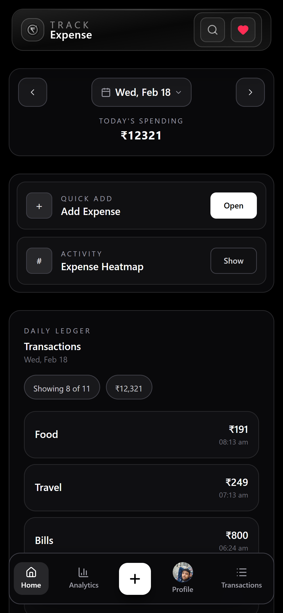
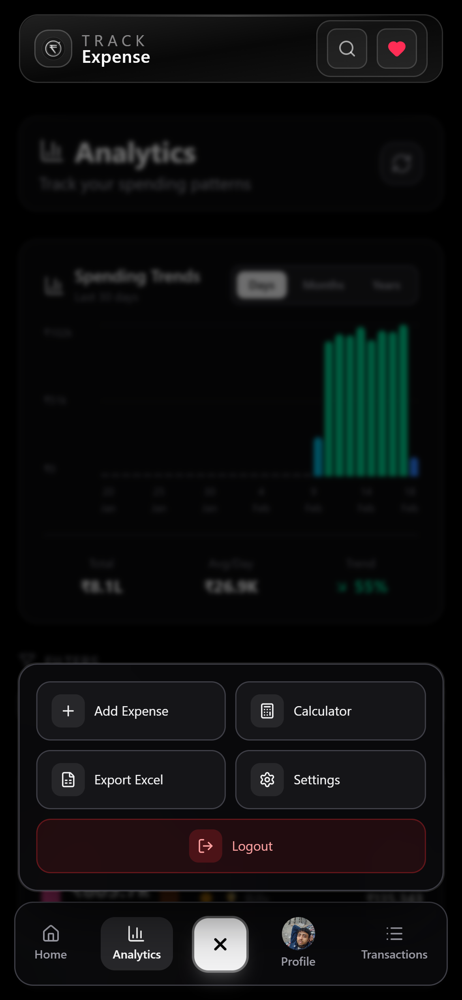
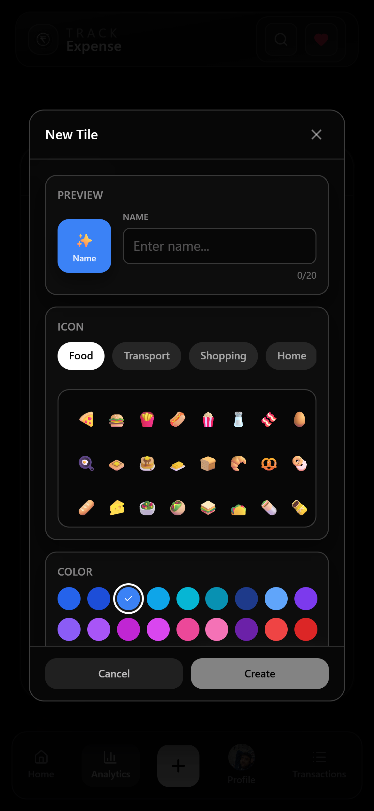
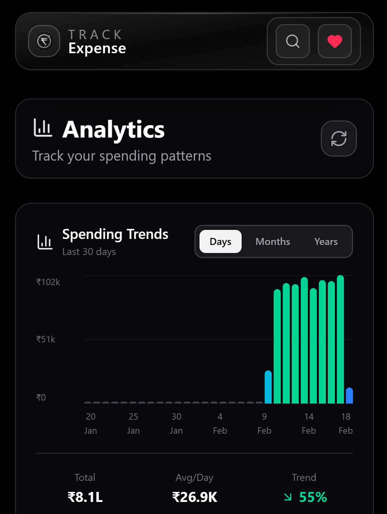
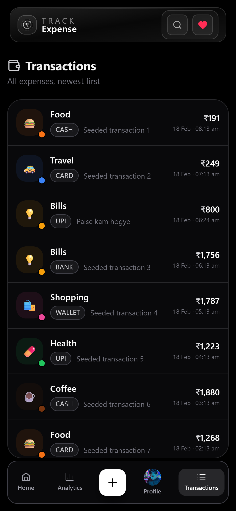
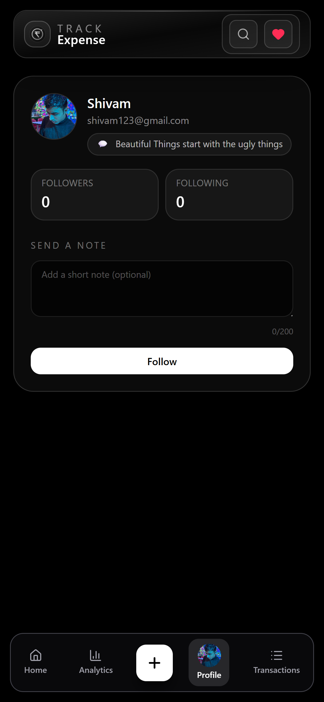
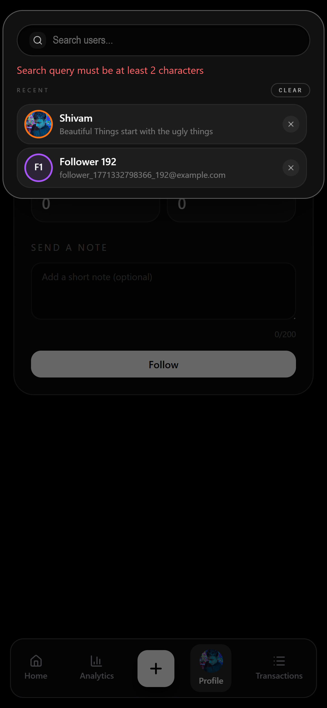
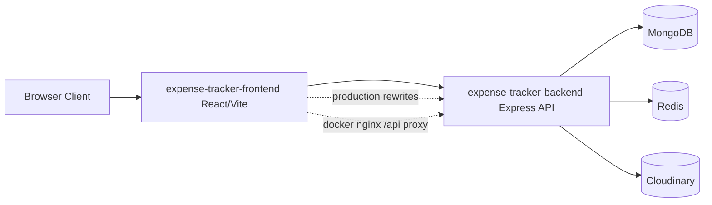
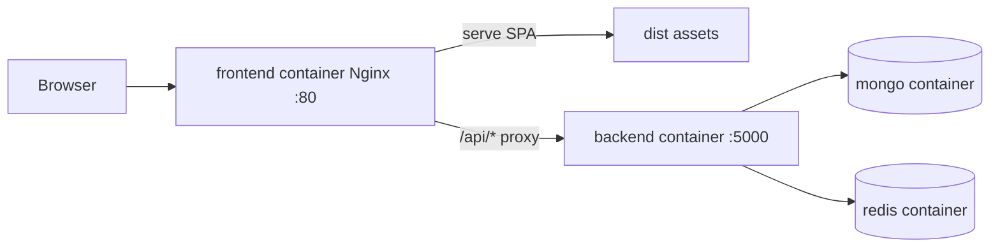

# 1. Project Title

## Expense Tracker Frontend

Expense Tracker Frontend is a mobile-first React application for daily expense capture, analytics, social discovery, and export workflows.

---

# 2. Project Overview

This frontend is the user-facing layer of the Expense Tracker platform. It is built as a Vite + React SPA and integrates with a cookie-authenticated backend API.

The app focuses on fast daily usage patterns:

- Quick expense entry from home actions
- Date-aware browsing and transaction history
- Analytics for trends, recurring expenses, and payment behavior
- Social features like follow requests, public profiles, and notifications
- Export-ready data views for reporting

In production, the app can send relative `/api/*` requests and rely on hosting rewrites/proxy rules to reach backend services.

---

# 3. Screenshots

### 🏠 Home → Quick Actions

<p align="center">
  
  &nbsp;&nbsp;&nbsp;
  
</p>
<p align="center">
  
  &nbsp;&nbsp;&nbsp;
  
</p>

---

### 📈 Analytics → 💸 Transactions

<p align="center">
  
  &nbsp;&nbsp;&nbsp;
  
  &nbsp;&nbsp;&nbsp;
  
</p>

---

### 🪵 Axiom Logging

<p align="center">
  
</p>

---

### 📱 Lighthouse (Mobile)

<p align="center">
  
</p>

---

### 👤 Profile → 📤 Export

<p align="center">
  
  &nbsp;&nbsp;&nbsp;
  
</p>
<p align="center">
  
  &nbsp;&nbsp;&nbsp;
  
</p>

---

# 4. Features

- Email/password authentication flow (signup, login, logout)
- Protected routing with auth-aware redirects
- Day-level expense tracking with pagination
- Transaction feed for historical browsing
- Analytics dashboards (range, recurring, payment breakdown, trends, heatmap)
- Expense mutation flows (hide, restore, update)
- Category/tile management and seed initialization
- Social graph UX: search users, follow/unfollow, requests, followers/following
- Profile management: name, status, privacy, avatar upload, hide-amount preference
- Excel export by date range
- Lazy-loaded routes and heavy UI chunks for better initial load performance

---

# 5. Tech Stack

| Technology | Where Used | Why It Is Used |
| --- | --- | --- |
| React 19 | Frontend app | Component-driven UI and stateful rendering |
| TypeScript | Frontend app | Type safety for components, state, and API calls |
| Vite 7 | Frontend tooling | Fast local dev server and modern build pipeline |
| React Router DOM 7 | Routing | SPA route composition and protected route boundaries |
| Redux Toolkit | Global state | Predictable app state for auth/user and transaction slices |
| React Redux | State bindings | Hooks-based Redux integration in components |
| Axios | API layer | Centralized HTTP client with auth/error interceptors |
| Tailwind CSS 4 | Styling | Utility-first, responsive UI development |
| Day.js | Date handling | Lightweight date operations for analytics and UI |
| Nginx | Container runtime | Serves static SPA and proxies `/api/*` to backend in Docker |
| Vercel rewrites | Production routing | Routes frontend calls to backend API without exposing CORS complexity |

---

# 6. Project Architecture



Docker runtime view:



Text fallback diagram:

```text
Browser -> Frontend (React + Vite) -> Backend API (Express)
                                      -> MongoDB
                                      -> Redis
                                      -> Cloudinary
```

High-level request flow:

- User signs in and receives auth cookie from backend
- Frontend sends credentialed API requests (`withCredentials: true`)
- Protected routes load profile/session data before rendering app flows
- Backend performs auth/validation and returns domain data for UI modules

---

# 7. Project Folder Structure

```text
frontend/
├── src/
│   ├── Components/          # Page and UI components (home, analytics, profile, exports, modals)
│   ├── hooks/               # Custom hooks (for example idle prefetch behavior)
│   ├── routeWrapper/        # Axios API client and route guards
│   ├── store/               # Redux store, hooks, and slices
│   ├── utils/               # Shared utility modules and UI helpers
│   ├── App.tsx              # Route tree and protected/public routing
│   └── main.tsx             # App bootstrap entrypoint
├── public/                  # Static assets
├── docs/                    # Frontend learning notes and screenshots
├── Dockerfile               # Multi-stage frontend image build
├── nginx.conf               # SPA serving + API proxy in container
├── vite.config.ts           # Vite and chunk-splitting config
├── vercel.json              # Rewrite and header rules for deployment
└── package.json             # Scripts and dependencies
```

---

# 8. Installation Steps

## Prerequisites

- Git
- Node.js 18+ (Node.js 20 recommended)
- npm
- Running backend API (local or hosted)

## Clone repository

```bash
git clone <your-repo-url>
cd expense-tracker/frontend
```

## Create environment file

PowerShell (Windows):

```powershell
Copy-Item .env.example .env
```

Bash (macOS/Linux):

```bash
cp .env.example .env
```

## Install dependencies

```bash
npm install
```

---

# 9. Environment Variables

## Frontend (`frontend/.env`)

| Variable | Required | Purpose |
| --- | --- | --- |
| `VITE_API_BASE_URL` | Yes (for local dev) | Backend base URL in development (for example `http://localhost:5000`) |

Notes:

- In production builds, `src/routeWrapper/Api.ts` uses relative API base (`""`) and depends on host-level rewrites/proxy for `/api/*`.
- `frontend/vercel.json` currently rewrites `/api/:path*` to the deployed backend URL.

---

# 10. How to Run the Project

Use separate terminals for frontend and backend.

## 1) Start backend

From repository root:

```bash
cd Backend
npm install
npm run dev
```

Default backend URL: `http://localhost:5000`

## 2) Start frontend

From `frontend/`:

```bash
npm run dev
```

Default frontend URL: `http://localhost:5173`

## 3) Build and preview frontend (optional)

```bash
npm run build
npm run preview
```

---

# 11. Running with Docker

## Option A: Root docker compose (published images)

From repository root:

```powershell
docker compose pull
docker compose up -d
```

Open:

- Frontend: `http://localhost:5173`
- Backend test route: `http://localhost:5000/test`

Stop:

```powershell
docker compose down
```

## Option B: Build frontend image locally

From `frontend/`:

```bash
docker build -t expense-tracker-frontend-local .
docker run --rm -p 5173:80 expense-tracker-frontend-local
```

The container serves the SPA through Nginx and proxies `/api/*` to `http://backend:5000` (as defined in `frontend/nginx.conf`).

---

# 12. Routes and Backend API Usage

## Frontend Routes

| Route | Description |
| --- | --- |
| `/login` | Public authentication page |
| `/` | Home dashboard |
| `/analytics` | Analytics and trend visualizations |
| `/transactions` | Paginated transaction feed |
| `/profile` | Current user profile |
| `/profile/followers` | Followers list |
| `/profile/following` | Following list |
| `/profile/:id` | Public user profile view |
| `/settings` | User/account settings |
| `/exports` | Excel export workflow |

## Backend Route Groups Used by Frontend

| Prefix | Examples |
| --- | --- |
| `/api/auth/*` | `signup`, `login`, `logout`, `update/password` |
| `/api/profile/*` | `view`, `update`, `privacy`, `upload-avatar`, `user/:id` |
| `/api/expense/*` | `add`, `:date`, `paged` |
| `/api/expenseMutations/*` | `:id/hide`, `:id/restore`, `:id`, `:date/hidden` |
| `/api/expenseAnalytics/*` | `range`, `recurring`, `payment-breakdown`, `spending-trends`, `heatmap` |
| `/api/expenseExport/*` | `excel` |
| `/api/follow/*` | follow actions, follow requests, followers/following lists |
| `/api/search/*` | user search and recent searches |
| `/api/tile/*` | tile list/create |
| `/api/seed/*` | initial tile seeding |

---

# 13. Future Improvements

- Add focused unit and integration tests for route-level UI behavior
- Improve error boundaries and empty-state UX coverage
- Expand offline-first/PWA capabilities
- Harden accessibility checks across modals and dynamic lists
- Add stronger telemetry for frontend performance and failure diagnostics
- Continue bundle splitting and lazy-load tuning for slower mobile networks

---

# 14. Contributing Guidelines

1. Fork the repository.
2. Create a branch: `git checkout -b feat/your-feature-name`.
3. Keep changes scoped and include tests when feasible.
4. Update docs when routes, setup, or behavior changes.
5. Run `npm run lint` and `npm run build` before opening a PR.
6. Open a pull request describing what changed, why it changed, and how it was validated.

Recommended commit style:

- `feat: add xyz`
- `fix: correct abc`
- `docs: update frontend readme`
